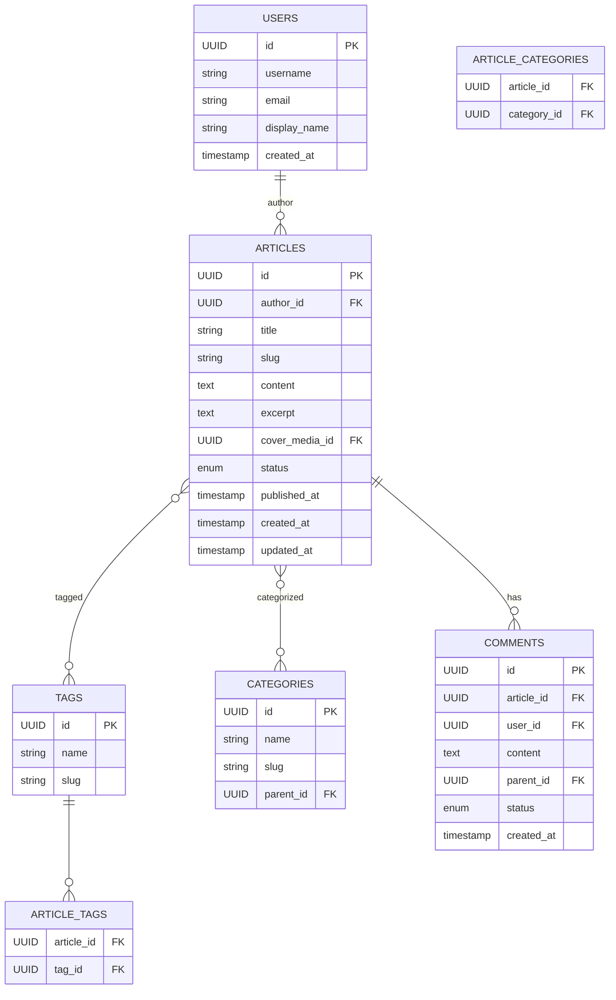
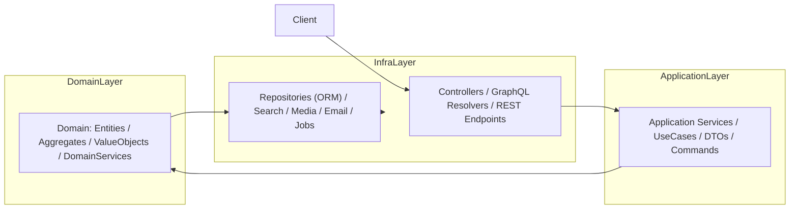

# 博客系统 — 完整 DDD 设计包

包含：
- DDD 领域上下文图（UML / Mermaid）
- 聚合 / 实体 / 值对象 详细设计
- ER（关系数据库）建模与 SQL 示例
- OpenAPI（示例） + URL 设计
- 前端页面结构与组件分解（含路由）
- 分层 / 六边形架构图（Mermaid）
- 管理后台（Admin）DDD 模板与文件结构
- Spring Boot / NestJS 可复制的关键代码片段

---

## 1. 领域上下文图（Context Map） — Mermaid UML

```mermaid
flowchart LR
  Config["Configuration BC\n(site settings, SEO)"]
  Auth["Auth BC\n(login, tokens)"]
  User["User BC\n(profile, roles)"]
  Media["Media BC\n(upload, CDN)"]
  Content["Content BC\n(Article, Tag, Category)"]
  Comment["Comment BC\n(comment, moderation)"]
  Search["Search BC\n(index, query)"]
  Stats["Statistics BC\n(PV/UV, analytics)"]
  Notify["Notification BC\n(email, webhooks)"]

  Config -->|used by| Content
  Auth <--> User
  User <--> Content
  Media <-- Content
  Content <--> Search
  Content <--> Comment
  Comment --> Notify
  Content --> Stats
  Comment --> Stats

  style Config fill:#f3f4f6,stroke:#111
  style Content fill:#fff3cd
  style Comment fill:#d1e7dd
```

---

## 2. 聚合 / 实体 / 值对象 详细表

> 只列重要字段（用于实现与数据库映射、领域逻辑）

### 2.1 Article 聚合（Aggregate Root）
- **Article (Aggregate Root / Entity)**
  - id: ArticleId (VO, UUID)
  - authorId: UserId
  - title: Title (VO)
  - slug: Slug (VO)
  - content: ContentBody (VO, Markdown)
  - excerpt: Excerpt (VO)
  - coverImageId: MediaId (nullable)
  - status: ArticleStatus ENUM {DRAFT, PUBLISHED, ARCHIVED}
  - publishedAt: datetime (nullable)
  - tags: List<TagId>
  - categories: List<CategoryId>
  - createdAt, updatedAt

**领域方法（示例）**: publish(), unpublish(), updateContent(), addTag(), removeTag()


### 2.2 Tag 聚合
- Tag
  - id: TagId
  - name: string
  - slug: Slug

### 2.3 Category 聚合
- Category
  - id: CategoryId
  - name, slug, parentCategoryId

### 2.4 Comment 聚合
- Comment
  - id: CommentId
  - articleId: ArticleId
  - userId: UserId (nullable for anonymous)
  - content: CommentBody VO
  - parentId: CommentId (nullable)
  - status: ENUM {PENDING, APPROVED, REJECTED, SPAM}
  - ipAddress: IpAddress VO
  - userAgent: string
  - createdAt, moderatedAt

领域方法：approve(), reject(), markSpam()

### 2.5 User 聚合
- User
  - id: UserId
  - username
  - displayName
  - email
  - roles: List<Role> (e.g. AUTHOR, ADMIN)
  - bio
  - avatarMediaId
  - createdAt

### 2.6 MediaFile 聚合
- MediaFile
  - id: MediaId
  - filename
  - url
  - size
  - mimeType
  - uploadedBy (UserId)
  - uploadedAt

### 2.7 Configuration
- kv 配置或结构化配置
  - siteTitle
  - siteDescription
  - theme (light/dark)
  - commentModerationMode

---

## 3. ER 数据库模型（简化版）



### 3.1 示例 SQL（Postgres）
```sql
CREATE TABLE users (
  id uuid PRIMARY KEY,
  username varchar(100) UNIQUE NOT NULL,
  email varchar(200) UNIQUE NOT NULL,
  display_name varchar(200),
  created_at timestamptz DEFAULT now()
);

CREATE TABLE articles (
  id uuid PRIMARY KEY,
  author_id uuid REFERENCES users(id),
  title varchar(400) NOT NULL,
  slug varchar(400) NOT NULL UNIQUE,
  content text,
  excerpt text,
  cover_media_id uuid,
  status varchar(20) NOT NULL,
  published_at timestamptz,
  created_at timestamptz DEFAULT now(),
  updated_at timestamptz DEFAULT now()
);

CREATE TABLE tags (
  id uuid PRIMARY KEY,
  name varchar(100) UNIQUE NOT NULL,
  slug varchar(100) UNIQUE NOT NULL
);

CREATE TABLE article_tags (
  article_id uuid REFERENCES articles(id) ON DELETE CASCADE,
  tag_id uuid REFERENCES tags(id) ON DELETE CASCADE,
  PRIMARY KEY (article_id, tag_id)
);
```

---

## 4. OpenAPI 示例（核心片段） + URL 设计

### 4.1 URL 设计（REST 风格）
```
GET  /api/articles                # 列表（分页、filter/tag/search）
POST /api/articles                # 创建文章（作者）
GET  /api/articles/{id}           # 读取文章
PUT  /api/articles/{id}           # 更新文章
POST /api/articles/{id}/publish   # 发布文章
GET  /api/articles/slug/{slug}    # 通过 slug 读取

GET  /api/articles/{id}/comments  # 获取文章评论
POST /api/articles/{id}/comments  # 发表评论
POST /api/comments/{id}/approve   # 审核评论

POST /api/auth/login
POST /api/auth/refresh
GET  /api/users/{id}

POST /api/media/upload            # 上传文件
GET  /api/tags
GET  /api/categories
```

### 4.2 OpenAPI 示例（YAML 片段）
```yaml
openapi: 3.0.3
info:
  title: Blog API
  version: 1.0.0
paths:
  /api/articles:
    get:
      summary: 列出文章
      parameters:
        - in: query
          name: page
          schema:
            type: integer
        - in: query
          name: tag
          schema:
            type: string
      responses:
        '200':
          description: 成功
    post:
      summary: 创建文章
      requestBody:
        required: true
        content:
          application/json:
            schema:
              $ref: '#/components/schemas/ArticleCreate'
      responses:
        '201':
          description: 创建成功

components:
  schemas:
    ArticleCreate:
      type: object
      required: [title, content]
      properties:
        title:
          type: string
        content:
          type: string
        tags:
          type: array
          items:
            type: string
```

---

## 5. 前端页面结构与组件（路由 + 组件树）

### 5.1 路由（React / Next.js 风格）
```
/                  -> HomePage (Latest + Featured)
/articles           -> ArticleListPage (分页、筛选)
/articles/[slug]    -> ArticleDetailPage
/archives           -> ArchivePage (按月归档)
/tags/[tag]         -> TagPage
/categories/[cat]   -> CategoryPage
/about              -> AboutPage
/admin              -> Admin Dashboard (需鉴权)
/admin/articles     -> Admin Article Management
/admin/comments     -> Admin Comment Moderation
/admin/media        -> Admin Media Manager
```

### 5.2 关键组件（可复用）
- `Header`（导航、搜索、登录按钮）
- `Footer`（版权、社交链接）
- `ArticleCard`（文章缩略卡片，用于列表）
- `ArticleContent`（文章详情渲染，支持代码高亮）
- `MarkdownEditor` / `RichEditor`（Admin 用）
- `CommentList`、`CommentForm`
- `TagCloud`、`CategoryList`
- `Pagination`、`FilterBar`

### 5.3 前端状态管理 & 数据获取
- Data fetching: 尽量用 SWR / React Query 或 Next.js `getStaticProps` + ISR
- Auth: JWT 存储在 HttpOnly cookie 或 secure storage
- Search: 调用后端 Search BC（或直接请求 ES/Algolia）

---

## 6. 分层架构 / Hexagonal（Mermaid）



实现要点：
- Domain 层不依赖 infra
- Application 层协调 domain 与 infra
- infra 提供 repository 的实现、外部服务适配器

---

## 7. 管理后台（Admin）DDD 模板

### 7.1 文件结构（建议）
```
admin/
├── src/
│   ├── modules/
│   │   ├── articles/
│   │   │   ├── application/
│   │   │   │   └── article-admin.service.ts
│   │   │   ├── domain/
│   │   │   │   └── article-admin.aggregate.ts
│   │   │   └── ui/
│   │   │       └── ArticleEditor.vue (or .tsx)
│   │   ├── comments/
│   │   └── media/
│   ├── shared/
│   │   └── auth/
│   └── main.ts
└── package.json
```

### 7.2 Admin 用例举例
- 批量审核评论（approve/reject）
- 文章草稿管理（预览 / 发布 / 回滚）
- 媒体管理（上传 / 删除 / 标记）
- 权限管理（角色赋予）

---

## 8. Spring Boot / NestJS 关键代码片段（可复制）

### 8.1 Spring Boot — Article Aggregate 简化示例
```java
// ArticleId.java (VO)
public record ArticleId(UUID value) {}

// Article.java
public class Article {
  private ArticleId id;
  private String title;
  private String content;
  private ArticleStatus status;
  // constructors/getters
  public void publish(){
    if(this.status == ArticleStatus.DRAFT) this.status = ArticleStatus.PUBLISHED;
  }
}

// ArticleRepository (interface)
public interface ArticleRepository {
  Optional<Article> findById(ArticleId id);
  void save(Article article);
}
```

### 8.2 NestJS — Article 聚合（简化）
```ts
// domain/article.entity.ts
export class ArticleId {
  constructor(public readonly value: string){}
}
export class Article {
  constructor(
    public id: ArticleId,
    public title: string,
    public content: string,
    public status: 'DRAFT'|'PUBLISHED'
  ){}
  publish(){ if(this.status === 'DRAFT') this.status = 'PUBLISHED'; }
}

// application/article.service.ts
@Injectable()
export class ArticleService {
  constructor(private repo: ArticleRepository){}
  async create(dto: CreateArticleDto){
    const article = new Article(new ArticleId(uuid()), dto.title, dto.content, 'DRAFT');
    await this.repo.save(article);
    return article.id;
  }
}
```

---

## 9. ER/DDD 进一步建议与落地步骤（3 个阶段）

**快速上线（MVP）**
1. 用 `articles`, `users`, `comments`, `tags`, `media` 表实现核心功能
2. 使用 Next.js静态+API routes 或 Spring Boot 提供 REST
3. 部署到 Vercel / Netlify（前端） + Heroku / Render / 云主机（后端）

**迭代优化**
1. 加入 Search（Elasticsearch / Algolia）
2. 增加 Statistics 服务（使用 Kafka 或 Redis + 后端批处理）
3. 添加 Notification（邮件/ webhook）

**企业化**
1. 使用事件溯源/领域事件（Domain Events）分离责任
2. 服务拆分（Content Service, Comment Service, User Service）
3. 加入 CQRS：读写分离，优化查询性能

---

## 10. 下一步（我可以直接帮你做）
- 生成 **完整 UML 图片（PNG / SVG）** 并打包下载
- 生成 **OpenAPI 文档完整版**（完整 schema + example）
- 根据你选的技术栈（Spring Boot / NestJS）生成 **可运行的样板工程**（zip）
- 生成 **前端 Next.js + Tailwind 的 starter repo**（含文章页面 + admin 简单界面）

告诉我你想先拿哪个（我可以立刻生成样板/文档）。

---

*文档完*

